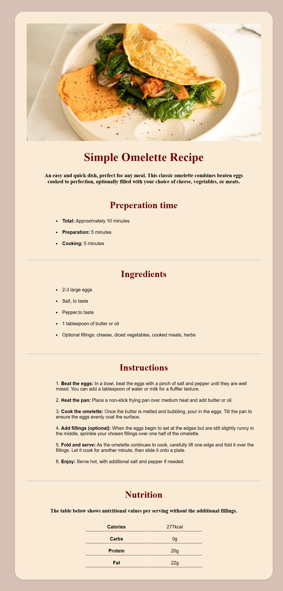
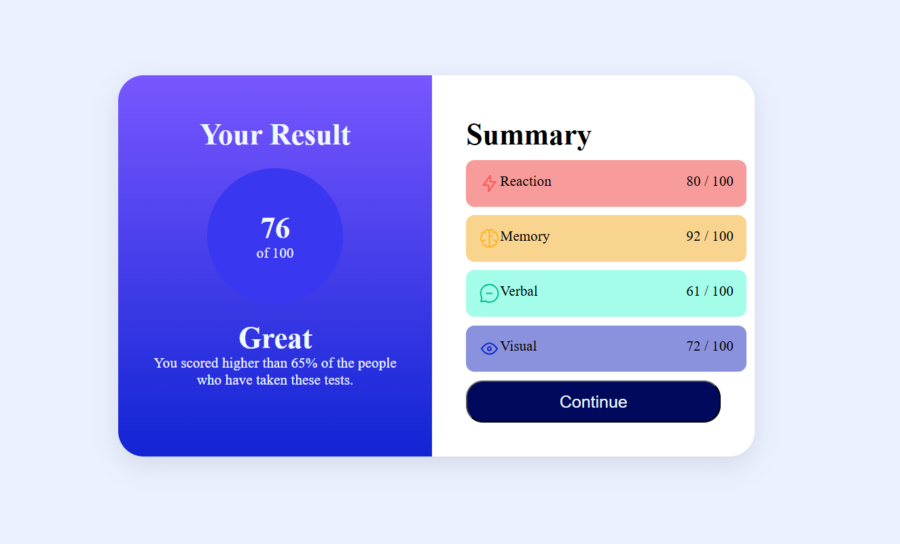
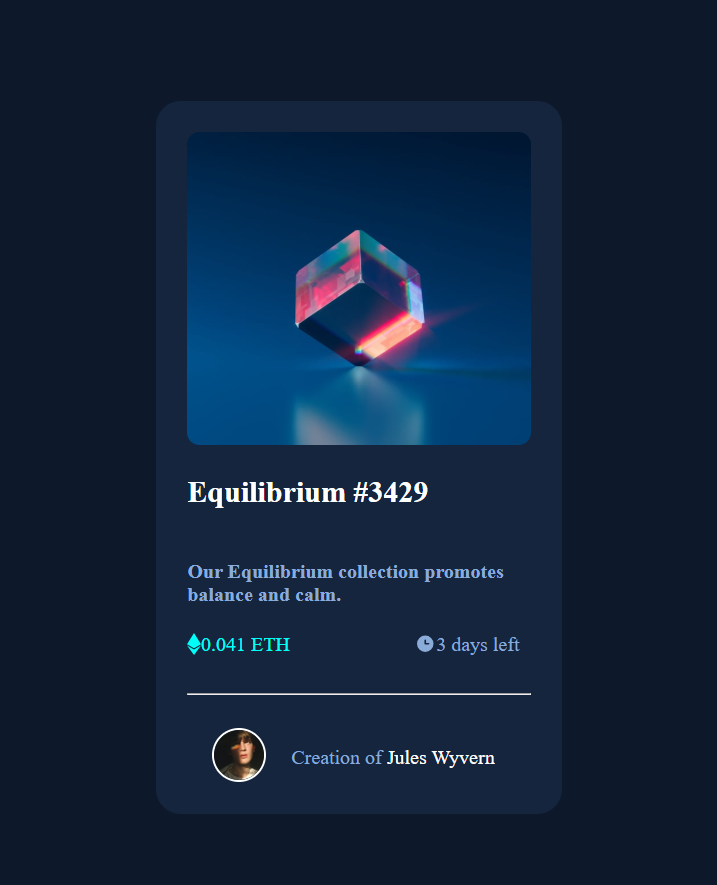
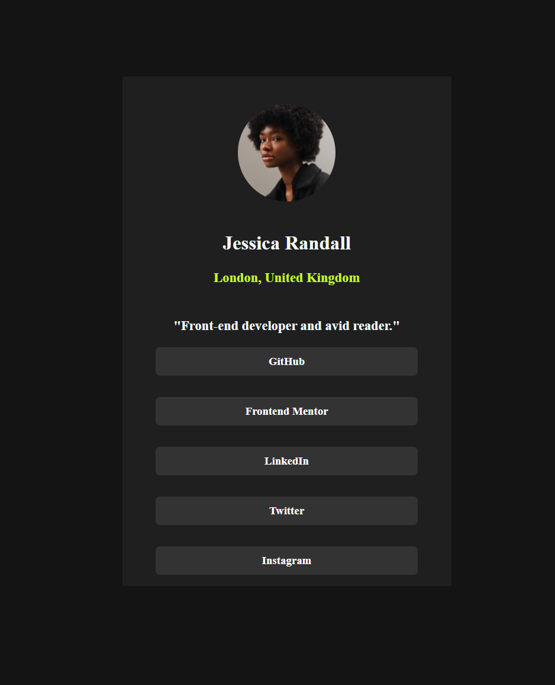
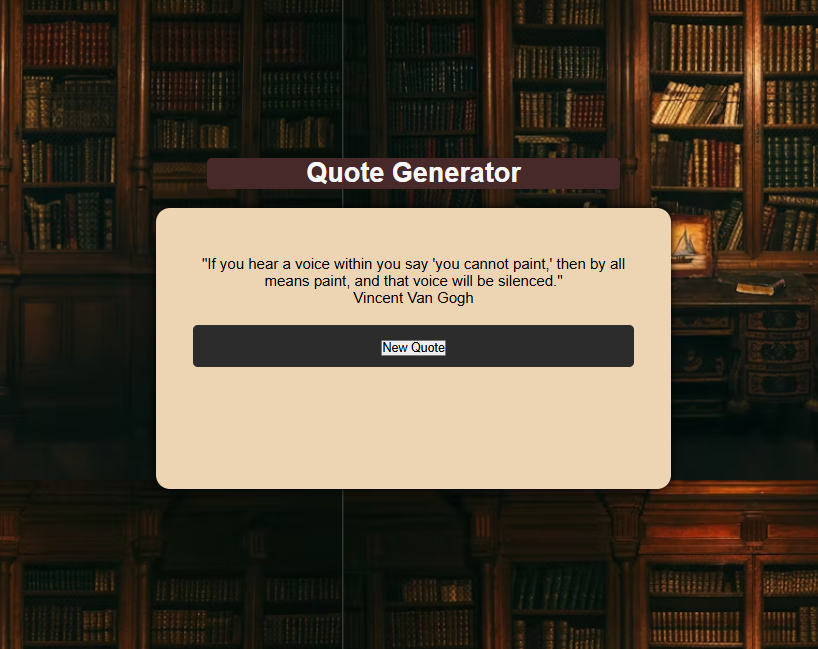
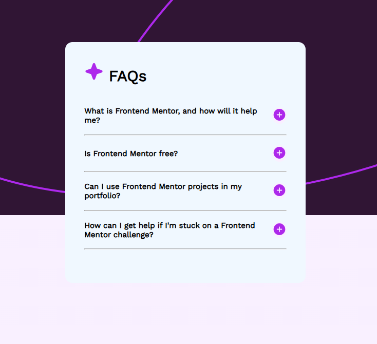

# 🌐 Web Development Projects 

Welcome to my web development portfolio repository!  
This repo contains all the projects I’ve built during my journey learning web development. Each project highlights different skills and technologies I’ve worked with.

Explore the list below to see live demos, code, and tools used.

---

## 📋 Table of Contents

- [1. Recipe Page](#1-recipe-page)
- [2. Result Summary Page](#2-result-summary-page)
- [3. Product Preview Page](#3-product-preview-page)
- [4. NFT Preview Card](#4-nft-preview-card)
- [5. Social Links Profile](#5-social-links-profile)
- [6. Quote Generator](#6-quote-generator)
- [7. FAQ - accordion](#7-FAQ-accordion)

---

## 🗃️ Projects

### 1. Recipe Page

**Description:**  
A clean and visually appealing recipe webpage that displays detailed ingredients and cooking instructions. It’s designed with a responsive layout for easy viewing on different devices, featuring organized sections and user-friendly navigation.

🔧 **Technologies Used:**  
HTML5, CSS3

🚀 **[Live Demo](https://dilnajoseph.github.io/web-dev_projects/recipe-page/)**

---

### 2. Result Summary Page

**Description:**  
An interactive result summary dashboard that visually presents user scores and performance metrics. Designed with HTML5 and styled using CSS3, leveraging Flexbox for responsive layout and clean alignment. JavaScript adds dynamic features such as score animations and conditional styling based on performance.

🔧 **Technologies Used:**  
HTML5, CSS3, JavaScript

🚀 **[Live Demo](https://dilnajoseph.github.io/web-dev_projects/result_summary/)**

---

### 3. Product Preview Page

**Description:**  
A sleek and modern product preview card showcasing product images, details, and pricing. Subtle hover effects and transitions are implemented with CSS animations to enhance user interaction.

🔧 **Technologies Used:**  
HTML5, CSS3

🚀 **[Live Demo](https://dilnajoseph.github.io/web-dev_projects/product_preview_card/)**

---

### 4. NFT Preview Card

**Description:**  
A stylish NFT preview card designed to showcase digital artwork with essential details like title, creator, and pricing. Includes interactive hover effects and subtle animations using CSS transitions for an engaging user experience.

🔧 **Technologies Used:**  
HTML5, CSS3

🚀 **[Live Demo](https://dilnajoseph.github.io/web-dev_projects/nft_preview_card/)**

---

### 5. Social Links Profile

**Description:**  
A clean and minimalistic profile page displaying social media links with icons and interactive hover effects. The project includes smooth hover animations and color transitions purely with CSS to enhance user interaction.

🔧 **Technologies Used:**  
HTML5, CSS3

🚀 **[Live Demo](https://dilnajoseph.github.io/web-dev_projects/2.%20social_links_profile/)**

---

### 6. Quote Generator

**Description:**  
This simple yet elegant web app displays motivational quotes from famous personalities with the click of a button. Built using HTML, CSS, and JavaScript. Whether you're starting your day or need a boost of inspiration, just click "New Quote" and let words of wisdom guide you!

🔧 **Technologies Used:**  
HTML5, CSS3, JavaScript

🚀 **[Live Demo](https://dilnajoseph.github.io/web-dev_projects/quote_generator/)**

---

### 7. FAQ accordion

**Description:**  
An interactive and responsive FAQ Accordion component that allows users to expand and collapse questions to view the corresponding answers. This project emphasizes clean layout, accessible HTML structure, and smooth transitions using CSS and JavaScript.

🔧 **Technologies Used:**  
HTML5, CSS3, JavaScript

🚀 **[Live Demo](https://dilnajoseph.github.io/web-dev_projects/FAQ%20-%20accordion/)**

---

